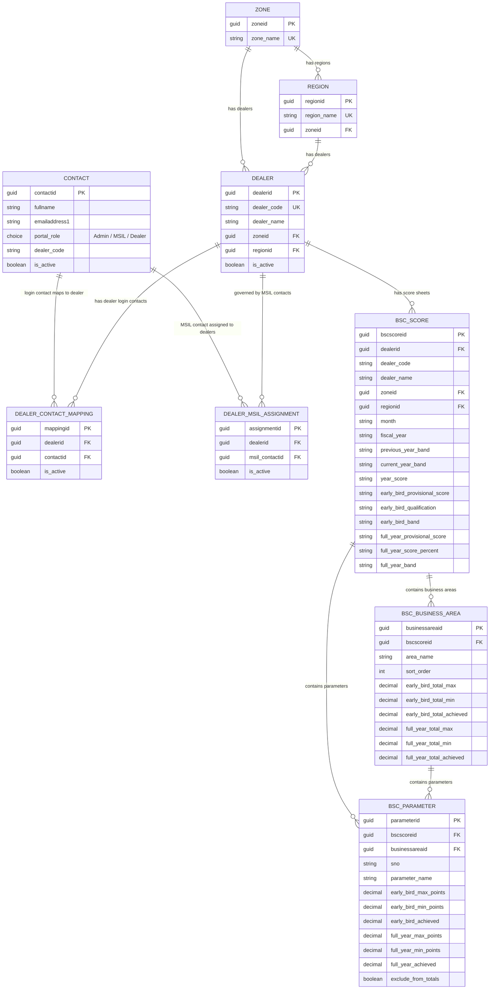
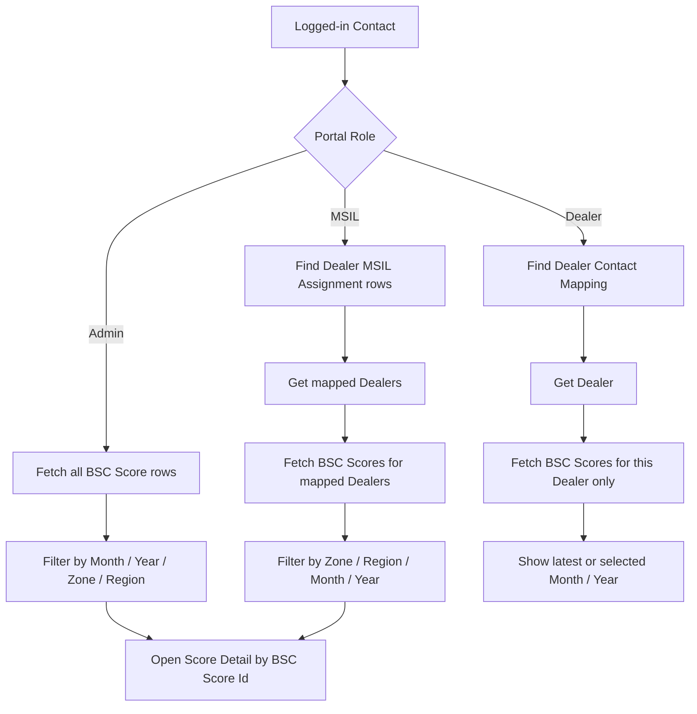
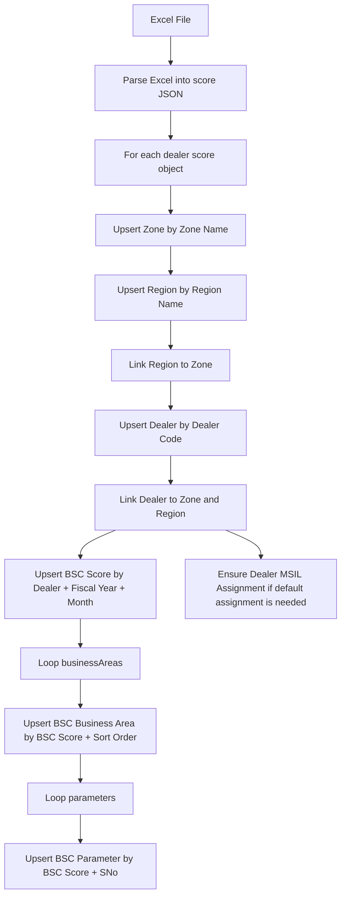
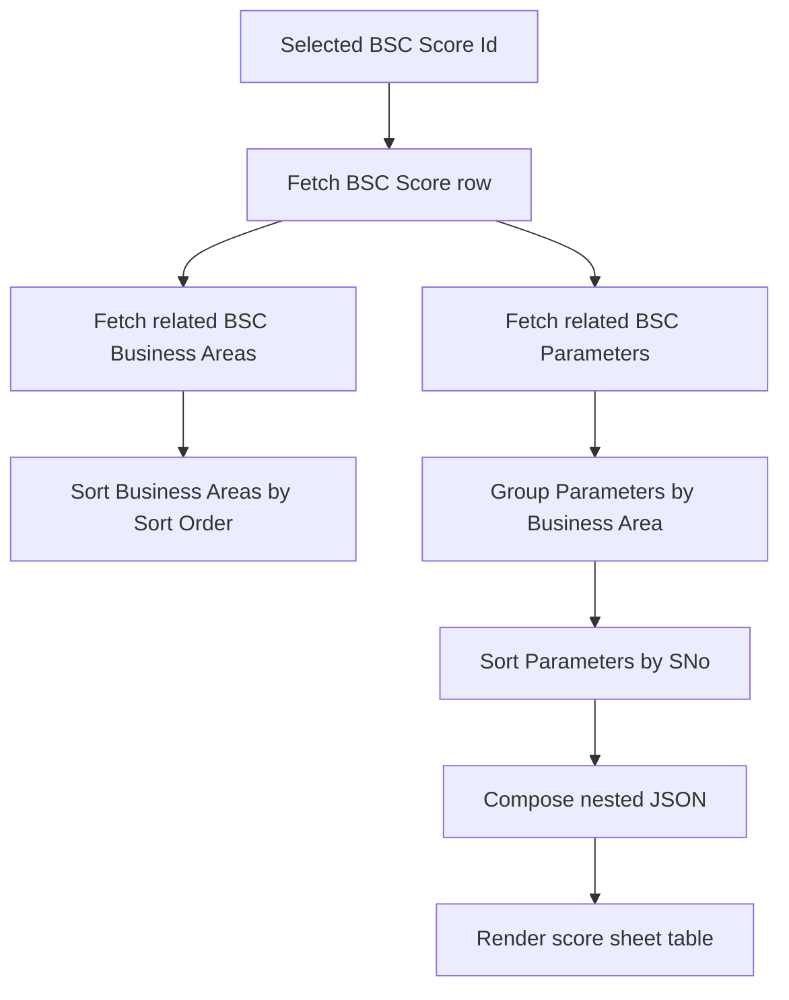

# Dataverse Table Mapping

This document shows the recommended Dataverse table structure for the BSC portal migration.

## Entity Relationship Diagram



## Lookup Mapping

```text
Region.Zone -> Zone.ZoneId

Dealer.Zone -> Zone.ZoneId
Dealer.Region -> Region.RegionId

Dealer Contact Mapping.Dealer -> Dealer.DealerId
Dealer Contact Mapping.Contact -> Contact.ContactId

Dealer MSIL Assignment.Dealer -> Dealer.DealerId
Dealer MSIL Assignment.MSIL Contact -> Contact.ContactId

BSC Score.Dealer -> Dealer.DealerId
BSC Score.Zone -> Zone.ZoneId
BSC Score.Region -> Region.RegionId

BSC Business Area.BSC Score -> BSC Score.BscScoreId

BSC Parameter.BSC Score -> BSC Score.BscScoreId
BSC Parameter.BSC Business Area -> BSC Business Area.BusinessAreaId
```

## Role-Based Access Flow



## Excel Upload Storage Flow



## Score Detail Fetch Flow



## Nested JSON Returned To Frontend

Power Automate should compose the Dataverse rows back into this shape for the current frontend rendering logic:

```js
{
  id: "bsc-score-guid",
  dealerCode: "EAST 3MTLAZ",
  dealerName: "MITTAL AUTOZONE",
  zone: "EAST",
  region: "EAST 3",
  month: "August",
  fiscalYear: "2028",
  earlyBird: {
    provisionalScore: "327/1000",
    qualification: "N",
    band: "NO BAND"
  },
  fullYear: {
    provisionalScore: "327/1000",
    provisionalScorePercent: "42%",
    band: "NO BAND"
  },
  businessAreas: [
    {
      areaName: "Sales Performance",
      parameters: [
        {
          sNo: "1",
          parameter: "All Models Wholesales Performance",
          earlyBird: {
            maxPoints: 40,
            minPoints: 0,
            achieved: 40
          },
          fullYear: {
            maxPoints: 40,
            minPoints: 0,
            achieved: 40
          }
        }
      ]
    }
  ]
}
```

## Build Order

```text
1. Zone
2. Region
3. Dealer
4. Dealer Contact Mapping
5. Dealer MSIL Assignment
6. BSC Score
7. BSC Business Area
8. BSC Parameter
```

Use the existing Dataverse `Contact` table for Admin, MSIL, and Dealer portal users.
